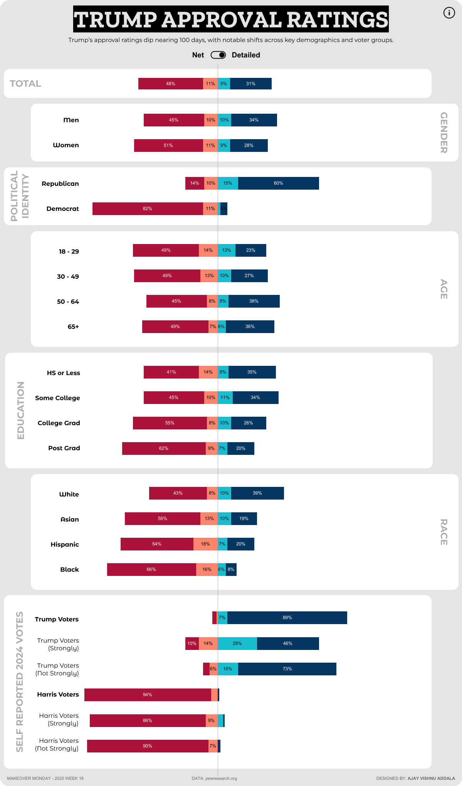

# Makeover Monday Week 18 Challenge: Trump's Approval Ratings Across Demographics

This visualization was created as part of the Makeover Monday Week 18 Challenge. It analyzes Trump's approval ratings across various demographic, political, and voter subgroups as he nears 100 days in his second term. The viz highlights significant shifts in approval ratings and provides insights into how different groups perceive his performance.

## 📊 Visualization Snapshot

## 🌐 View the Interactive Tableau Dashboard
Explore the full interactive dashboard on Tableau Public: [View Dashboard](https://public.tableau.com/views/TrumpApprovalRatingsMOM2025W18/MOM2025W18?:language=en-US&:sid=&:redirect=auth&:display_count=n&:origin=viz_share_link)

## 📄 Data Source
The data for this visualization is sourced from the Makeover Monday Week 18 dataset, which includes approval ratings segmented by age, gender, political affiliation, education, race, support level, and more.

## ✨ Key Insights
- Trump's approval rating has declined across most groups, with sharper drops among less enthusiastic supporters and nonvoters.
- Ratings among Asian Americans have seen the steepest decline, falling from 47% approval in February to 29% today.
- Overall, 40% of U.S. adults approve of Trump's performance, while nearly six-in-ten disapprove.

## 📅 About Makeover Monday
Makeover Monday is a weekly social data project aimed at improving data visualization and storytelling skills. Participants are encouraged to reimagine the provided dataset, presenting it in creative and insightful ways.

## 🛠️ Tools Used
- **Tableau**: For creating the interactive visualization.
- **GitHub**: For documentation and sharing the project.
